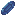
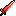

<h1 align="center">Moritur</h1>

**Moritur** is a _2D action top-down roguelike game_ written during the 48 hours GMTK Game Jam 2022. The jam main theme to implement was **Roll of the Dice**, so the _randomness_ of the dice is the crucial mechanics of the game.

The game is inspired by a board games concept. You start at a game board filled with different kinds of rooms represented as a tiles on the board, and rolling the dice decides the cell player will face. Every upgrade and game progression is random for the player. The goal is to reach the last boss level and defeat him.

## Board cells

There are different types of tiles on the board, each representing a certain room to be entered by the player:

- [x] **combat** : a random room full of the enemies to kill to pass it. There are two types of enemies: range and melee

   
  
  
  
  
  
   

- [x] **loot** : a random power-up or weapon.
  
  

  There are 9 different possible power-ups for your character:

  * _Elements_: fire  / poison  / ice  attacks
  * _Health_: heal  / encrease max lifes 
  * _Increase projectile_: damage  / speed  / size 
  * _CD_: Decrease cool-down of the attacks 
  
  

  There are also 5 different weapons, each depending on the power-up element (fire / poison / ice / none):
  * _Swords_ dealing the AOE damage    
  * _Bows_ piercing the enemies 
  * 3 types of range-attacking _wands_ each with different characteristics: a strong , medium , and weak 

- [x] **rollback** : you move your current position on the board randomly forwards / backwards on an arbitrary number of steps

- [ ] **shop** : to buy the upgrades for the character

- [x] **final boss**  room as the very last tile of the game.

## Contributors:
* Player mechanics and power-ups / weapons: [Ostap Trush](https://github.com/Adeon18)
* Enemy design: [Oleksiy Hoyev](https://github.com/alexg-lviv)
* Room and random board generation: [Bohdan Ruban](https://github.com/iamthewalrus67)
* Art and visuals: [Alina Bondarets](https://github.com/alorthius)
